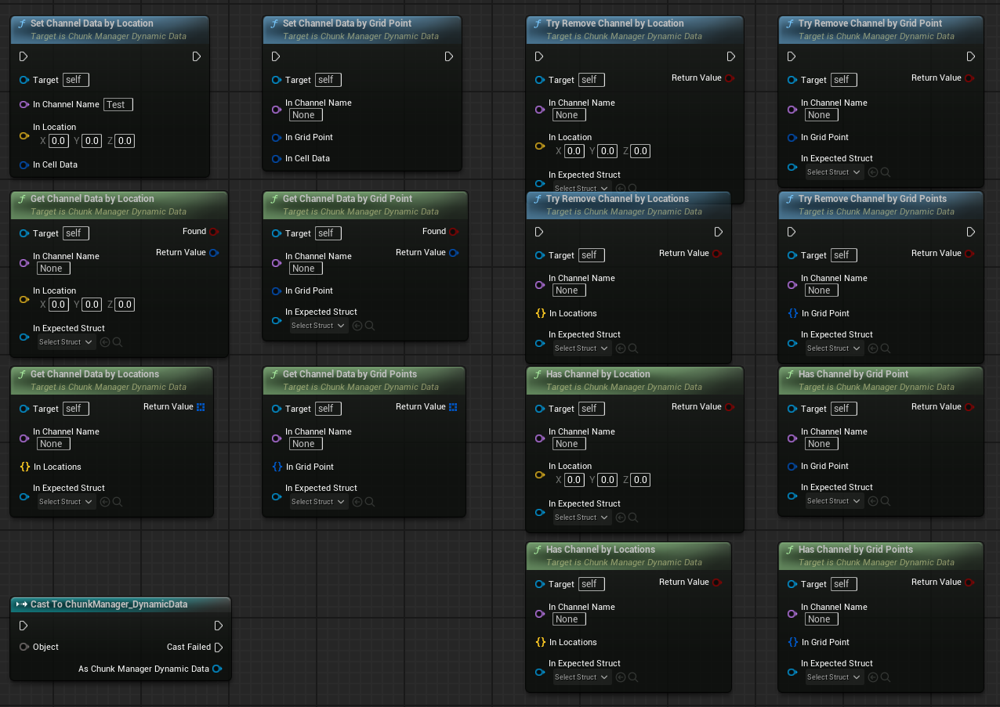
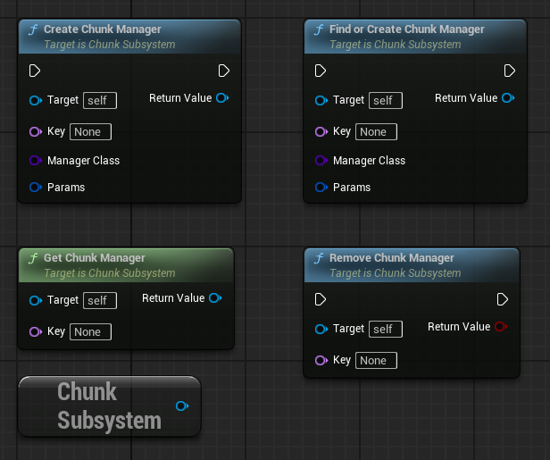

# SimpleChunkSystem

SimpleChunkSystem is a Unreal Engine plugin that provides a basic framework for grid-based chunk management. It exposes a set of C++ classes and Blueprint nodes that make it easy to create and manipulate chunks of the game world.

## Features
- **ChunkSubsystem** – a `GameInstance` subsystem that lets you create and manage chunk managers keyed by name.
- **ChunkManagerBase** – an abstract manager class that encapsulates a concrete chunk system implementation.
- **ChunkSystemBase** – a template system that maintains a set of chunks and handles coordinate transforms and serialization.
- **Dynamic data support** – sample implementations `UChunkManager_DynamicData` and `FChunkSystem_DynamicData` allow storing custom structures in chunk cells.

## Custom Data Structures (IMPORTANT)
**All custom cell data structures must inherit from `FCellBaseInfo`.**  
Only types derived from `FCellBaseInfo` are recognized by `FChunkSystem_DynamicData` / `UChunkManager_DynamicData` and will be stored, serialized, and read correctly.

## Blueprint Functions
Functions are available in Blueprint in Chunk Manager Dynamic Data:


Functions are available in Chunk Subsystem:



## Example: Simple Structure with Basic Properties
If you need a simple structure to store basic properties, you can define it like this:
```c++
USTRUCT(BlueprintType)
struct FChunkData_ObjectInfo : public FCellBaseInfo
{
	GENERATED_BODY()

	/** UObject stored in the cell. */
	UPROPERTY(EditAnywhere, BlueprintReadWrite, Category = "Chunk Data")
	TObjectPtr<UObject> Object;

	virtual bool Serialize(FArchive& Ar) override;

	friend FArchive& operator<<(FArchive& Ar, FChunkData_ObjectInfo & Data);
};
```

## Example: How to work in Blueprint
You can create a chunk manager and use it in Blueprint like this:


## Installation
1. Copy the `SimpleChunkSystem` folder into your project's `Plugins` directory.
2. Open the project and let the engine compile the plugin.

## Usage
1. Add `ChunkSubsystem` to your `GameInstance`.
2. Use Blueprint or C++ to create chunk managers via `CreateChunkManager` or `FindOrCreateChunkManager`.
3. Use the managers to spawn or remove chunks and to work with dynamic data.

## Development
- The plugin is written in C++17 and uses standard Unreal Engine macros.
- Unit tests are located in `Source/SimpleChunkSystem/Public/UnitTest`.

## License
MIT License

Copyright (c) 2025 Olexander Zoshchuk
Permission is hereby granted, free of charge, to any person obtaining a copy
of this software and associated documentation files (the "Software"), to deal
in the Software without restriction, including without limitation the rights
to use, copy, modify, merge, publish, distribute, sublicense, and/or sell
copies of the Software, and to permit persons to whom the Software is
furnished to do so, subject to the following conditions:
The above copyright notice and this permission notice shall be included in all
copies or substantial portions of the Software.

THE SOFTWARE IS PROVIDED "AS IS", WITHOUT WARRANTY OF ANY KIND, EXPRESS OR
IMPLIED, INCLUDING BUT NOT LIMITED TO THE WARRANTIES OF MERCHANTABILITY,
FITNESS FOR A PARTICULAR PURPOSE AND NONINFRINGEMENT. IN NO EVENT SHALL THE
AUTHORS OR COPYRIGHT HOLDERS BE LIABLE FOR ANY CLAIM, DAMAGES OR OTHER
LIABILITY, WHETHER IN AN ACTION OF CONTRACT, TORT OR OTHERWISE, ARISING FROM,
OUT OF OR IN CONNECTION WITH THE SOFTWARE OR THE USE OR OTHER DEALINGS IN THE
SOFTWARE.

This license allows the software to be used for any purposes, including commercial, and to be modified and improved as needed.
